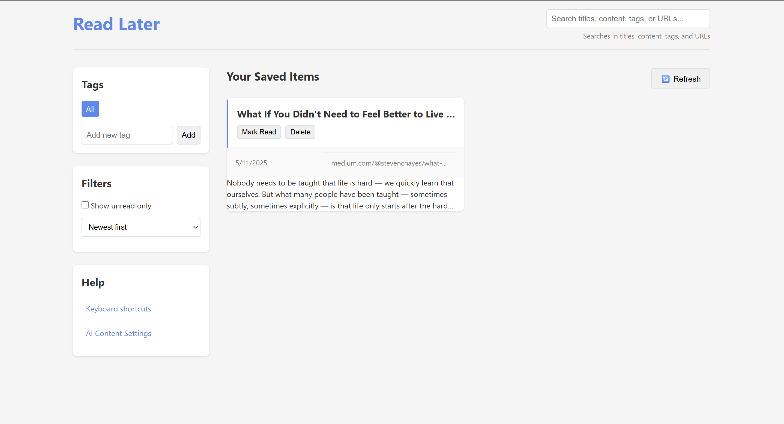
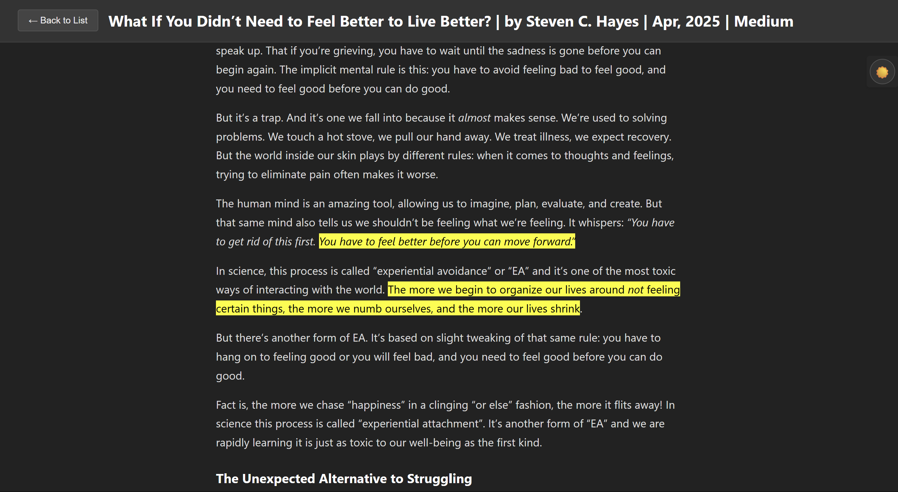

# Read Later

Chrome extension for saving articles and content to read later. Easily organize your reading list with tags, search functionality, and a distraction-free reading experience.

## Features

### Quick Save with Keyboard Shortcut
Press `Alt+R` to quickly save the current page with tags. A dialog will appear allowing you to add tags to the page before saving.

### Organized Reading List
View all your saved items in a clean, organized list. Filter by tags, search content, and sort by date or title.

### Distraction-Free Reader View
Read your saved content in a clean, distraction-free reader view with dark mode support. Toggle between light and dark mode using the sun/moon icon.

### Advanced Content Parsing
The extension intelligently removes navigation bars, ads, and other distractions from saved pages to present only the relevant content.

#### AI-Powered Content Extraction
Optionally use OpenAI's GPT-4o to improve content extraction by intelligently identifying main content, relevant images, and removing unnecessary elements.

## How to Use

### Saving Content
- **Keyboard Shortcut**: Press `Alt+R` on any page to save it with tags
- **Extension Icon**: Click the extension icon in your toolbar
- **Context Menu**: Right-click on a page or link and select "Save to Read Later"

### Organizing Content
- **Tags**: Add tags when saving or edit tags later
- **Search**: Use the search bar to find content by title, tags, or text
- **Filters**: Show only unread items or sort by newest, oldest, or title

### Reading Content
1. Click on any saved item to open it in reader view
2. Toggle dark mode using the sun/moon icon
3. Return to your list by clicking "Back to List"

### Managing Saved Items
- Mark items as read/unread
- Delete items you no longer need
- Refresh your list with the refresh button

## Settings

### AI Content Parsing
Enable AI-powered content extraction for better reading experiences:

1. Go to Settings
2. Enable "Use AI-powered content extraction"
3. Enter your OpenAI API key
4. Select your preferred model

## Keyboard Shortcuts

- `Alt+R`: Save current page with tag selection dialog

## Installation

1. Download the extension files
2. Open Chrome and go to `chrome://extensions/`
3. Enable "Developer mode" in the top right
4. Click "Load unpacked" and select the extension folder
5. The Read Later extension is now installed and ready to use

## Privacy

This extension stores all your saved content locally on your device. If you enable AI content parsing, content will be sent to OpenAI for analysis using your API key. 